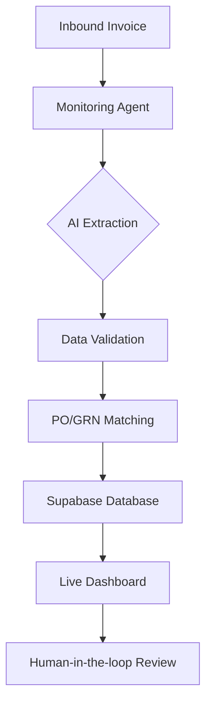

# AI Invoice Processing Agent 🤖📄

A state-of-the-art AI-driven transition system designed to automate accounts payable workflows. This agent handles live ingestion, monitors activity via a real-time dashboard, and performs intelligent invoice extraction and matching.

 *(Note: Replace with actual screenshot after deployment)*

## 🌟 Features

- **🚀 Live Ingestion Monitoring**: Real-time visualization of inbound invoice processing.
- **🧠 AI-Powered Extraction**: High-accuracy data extraction from complex invoice layouts.
- **⚖️ PO/GRN Reconciliation**: Automated matching of invoices against Purchase Orders and Goods Receipt Notes.
- **📊 Real-time Dashboard**: Premium UI with dark mode support and dynamic animations.
- **🔐 Supabase Integration**: Robust backend storage and authentication.

## 🏗️ Architecture



## 🛠️ Tech Stack

- **Frontend**: Next.js 14, TailwindCSS, TypeScript, Framer Motion, Lucide Icons.
- **Backend**: Python (FastAPI), Gemini AI API.
- **Database**: Supabase (PostgreSQL + Storage).
- **Deployment**: Vercel.

## 🚀 Getting Started

### Prerequisites

- Node.js 18+
- Python 3.10+
- Supabase Account
- Google Gemini API Key

### Installation

1. **Clone the Repository**
   ```bash
   git clone <your-repo-url>
   cd invoice
   ```

2. **Frontend Setup**
   ```bash
   cd frontend
   npm install
   cp .env.local.example .env.local
   # Fill in your Supabase & Gemini credentials
   npm run dev
   ```

3. **Backend Setup**
   ```bash
   cd backend
   python -m venv venv
   source venv/bin/activate  # On Windows: venv\Scripts\activate
   pip install -r requirements.txt
   cp .env.example .env
   # Fill in your credentials
   python main.py
   ```

## ☁️ Deployment on Vercel

This project is optimized for deployment on Vercel.

### Frontend Deployment

1. Push your code to GitHub.
2. Go to [Vercel Dashboard](https://vercel.com).
3. Import the repository and select the `frontend` folder as the **Root Directory**.
4. Configure Environment Variables (`NEXT_PUBLIC_SUPABASE_URL`, `NEXT_PUBLIC_SUPABASE_ANON_KEY`, etc.).
5. Click **Deploy**.

### Backend Deployment (Optional)

The backend can be deployed as a separate Vercel project using the Python runtime or hosted on a platform like Render/Railway. If using Vercel, ensure the `backend` directory contains a valid `vercel.json` if you wish to run it as serverless functions.

## 📄 License

MIT License - feel free to use this project for your own automation needs!

---

Developed with ❤️ by [Dhaval Trivedi]
