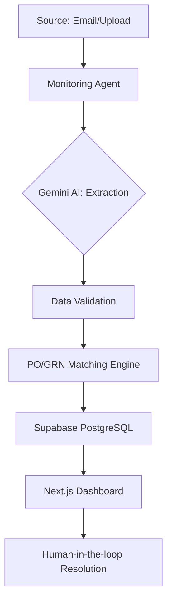

# AI Invoice Processing Agent 🤖📄

A state-of-the-art AI-driven automation system designed to streamline accounts payable (AP) workflows. This agent monitors inbound invoices, performs intelligent data extraction using Gemini AI, and handles PO/GRN reconciliation with a real-time dashboard.

[](https://ai-invoice-agent-beta.vercel.app/)
[](https://opensource.org/licenses/MIT)

---

## 🌟 Key Features

- **🚀 Live Ingestion Monitoring**: Real-time visualization of inbound invoice processing via a modern dashboard.
- **🧠 AI-Powered Extraction**: High-accuracy data extraction from complex invoice layouts using Google Gemini Pro.
- **⚖️ PO/GRN Reconciliation**: Automated matching of invoices against Purchase Orders and Goods Receipt Notes.
- **📊 Real-time Dashboard**: Premium UI with dark mode support, fluid animations, and comprehensive analytics.
- **📬 Gmail Integration**: Automatically poll and process invoices received via email.
- **🔐 Secure Persistence**: Robust backend storage and authentication powered by Supabase.

---

## 🏗️ Technical Architecture



---

## 🛠️ Technology Stack

### Frontend
- **Framework**: Next.js 14+ (App Router, Turbopack)
- **Styling**: TailwindCSS 4 (CSS-first configuration)
- **Animations**: Framer Motion
- **State Management**: TanStack React Query
- **Icons**: Lucide React

### Backend
- **Framework**: Python (FastAPI)
- **AI**: Google Gemini AI API
- **Scheduler**: APScheduler for background tasks

### Infrastructure
- **Database/Storage**: Supabase
- **Deployment**: Vercel (Experimental Multi-Service Setup)

---

## 🚀 Getting Started

### Prerequisites

- Node.js 18+
- Python 3.10+
- Supabase Account (New project with database schema applied)
- Google Gemini API Key
- Google Cloud Console for Gmail API credentials (optional)

### Local Development Setup

1. **Clone the Repository**
   ```bash
   git clone https://github.com/Vikas-Claude-Demo/ai-invoice-agent.git
   cd ai-invoice-agent
   ```

2. **Frontend Configuration**
   ```bash
   cd frontend
   npm install
   cp .env.local.example .env
   # Add your NEXT_PUBLIC_SUPABASE_URL and NEXT_PUBLIC_SUPABASE_ANON_KEY
   npm run dev
   ```

3. **Backend Configuration**
   ```bash
   cd ../backend
   python -m venv venv
   source venv/bin/activate  # Windows: venv\Scripts\activate
   pip install -r requirements.txt
   cp .env.example .env
   # Configure your Supabase, Gemini, and Gmail keys
   python main.py
   ```

---

## ☁️ Deployment on Vercel

This repository is optimized for Vercel's multi-service deployment.

1. **Connect Repository**: Link your GitHub repo to Vercel.
2. **Multi-Service Detection**: Vercel will automatically detect `vercel.json` and deploy both the Next.js frontend and the FastAPI backend.
3. **Environment Variables**: Add the following keys in your Vercel Dashboard:

| Variable | Description |
| :--- | :--- |
| `NEXT_PUBLIC_SUPABASE_URL` | Your Supabase Project URL |
| `NEXT_PUBLIC_SUPABASE_ANON_KEY` | Your Supabase Anon Key |
| `GEMINI_API_KEY` | Google Gemini AI API Key |
| `SUPABASE_SERVICE_KEY` | Supabase Service Role Key (for backend) |
| `GMAIL_CLIENT_ID` | Google OAuth Client ID |
| `GMAIL_CLIENT_SECRET` | Google OAuth Client Secret |
| `GMAIL_REDIRECT_URI` | `https://your-domain.vercel.app/_/backend/api/gmail/callback` |
| `SECRET_KEY` | A long random string for auth tokens |

---

## 📂 Project Structure

```text
.
├── frontend/             # Next.js 14 Application
│   ├── app/              # Routes and Pages
│   ├── components/       # UI Components (Shadcn UI)
│   └── lib/              # API and Supabase clients
├── backend/              # FastAPI Python Backend
│   ├── app/              # API Logic and Services
│   └── main.py           # Entry point
└── vercel.json           # Multi-service deployment config
```

---

## 📄 License

Distributed under the **MIT License**. See `LICENSE` for more information.

---

Developed with ❤️ by [Dhaval Trivedi]
