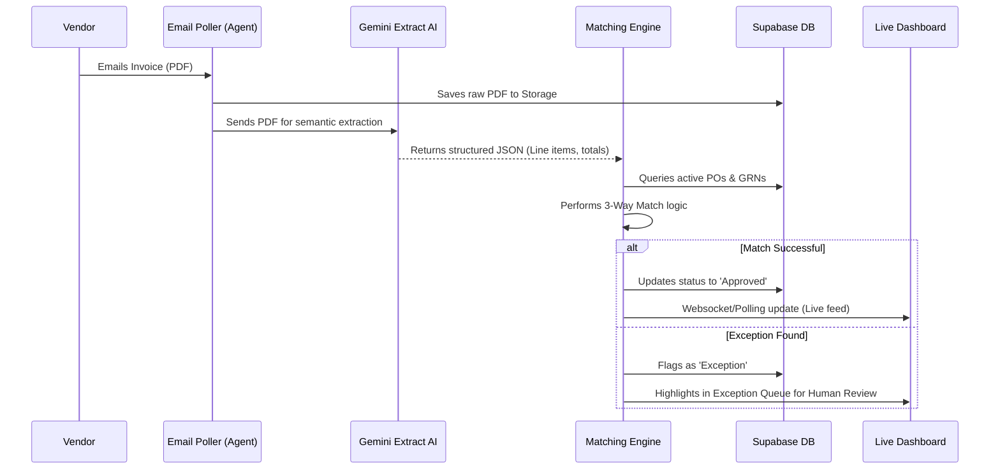

# Case Study: AI-Driven Invoice Processing Agent – Automating the Accounts Payable Lifecycle

## 1. Executive Summary

This case study details the design, development, and implementation of a state-of-the-art AI Invoice Processing Agent. The system was built to solve the inherently manual, error-prone, and time-consuming processes found in traditional Accounts Payable (AP) workflows. By leveraging advanced Large Language Models (LLMs - Google Gemini), real-time monitoring via a Next.js dashboard, and robust integrations with Supabase and automated email polling, the solution transforms inbound invoice handling from a human-intensive bottleneck into an intelligent, seamless, and largely autonomous pipeline. 

This agentic system not only extracts unstructured data with high accuracy but also performs intelligent three-way matching against Purchase Orders (POs) and Goods Receipt Notes (GRNs), drastically reducing exceptions and processing time.

---

## 2. The Problem Statement

In modern enterprises, Accounts Payable remains one of the most operationally heavy departments. Despite technological advances, many AP teams still struggle with:

1.  **High Volume of Unstructured Data:** Invoices arrive in myriad formats (PDFs, images, embedded in emails) from various vendors, with inconsistent layouts. Traditional OCR (Optical Character Recognition) templates are brittle and fail when vendors change their invoice designs.
2.  **Manual Data Entry and High Error Rates:** Clerks spend countless hours manually typing line items, taxes, and totals into ERP systems, leading to costly data entry errors.
3.  **Complex Reconciliation (Three-Way Matching):** To approve payment, an invoice must be matched against a Purchase Order and the actual Goods Receipt Note (GRN). Doing this manually requires cross-referencing multiple systems and documents.
4.  **Lack of Real-Time Visibility:** CFOs and AP managers lack real-time insights into the processing pipeline, making cash flow forecasting difficult and allowing bottlenecks to go unnoticed until late payment penalties are incurred.

**The Goal:** Build an intelligent, agentic solution capable of ingesting invoices from multiple sources, parsing them conceptually rather than positionally, reconciling the data automatically, and providing real-time visibility into the entire lifecycle.

---

## 3. The Proposed Solution

We designed an **AI Invoice Processing Agent** — an end-to-end FinTech automation platform that combines a Python (FastAPI) backend for heavy orchestration with a premium Next.js frontend for monitoring and exception handling.

### Key Components:

1.  **Omnichannel Ingestion:** The agent actively polls configured Gmail accounts via IMAP/API to grab inbound invoices automatically. It also supports direct UI uploads for immediate processing.
2.  **Generative AI Data Extraction:** Instead of using fixed coordinate-based OCR, the system utilizes the Google Gemini API. By prompting the multimodal LLM to "understand" the document, it reliably extracts semantic entities (Vendor Name, Invoice Number, Line Items, Taxes, Totals) regardless of the document's visual layout.
3.  **Automated PO/GRN Matching Engine:** Once structured data is extracted, the backend logic intelligently compares it against the simulated ERP database containing POs and GRNs, flagging discrepancies (price mismatches, quantity differences).
4.  **Live Ingestion Monitoring Dashboard:** A high-end, responsive Next.js dashboard (with dark mode and Framer Motion animations) provides real-time visualization of the agent’s activity. AP staff can watch invoices flow through the pipeline, review flagged exceptions, and approve unmatched items with "human-in-the-loop" oversight.

---

## 4. Architecture & Technology Stack

The technological foundation was chosen for speed, scalability, and AI integration.

*   **Frontend Interface:** Next.js 14, React, TailwindCSS, TypeScript, Framer Motion for micro-animations, and Lucide icons for a premium aesthetic. It provides a real-time, dynamic view of the AP pipeline.
*   **Backend Orchestration:** Python with FastAPI. Python is ideal for AI workflows and asynchronous processing (using `apscheduler` for background polling). 
*   **AI Engine:** Google Gemini API for unstructured document understanding and extraction.
*   **Database & Storage:** Supabase (PostgreSQL) for relational data (invoices, vendors, POs, logs) and Supabase Storage for secure PDF archiving.

### System Workflow

---

## 5. Key Challenges & How We Overcame Them

### Challenge 1: Brittle Data Extraction
*   *Issue:* Traditional OCR systems required setting up a new template for every vendor. When a vendor moved their logo or changed a column width, the extraction failed.
*   *Solution:* Transitioned to **Generative AI Document Understanding**. By passing the document image/PDF to Gemini with a rigorous system prompt demanding JSON output, the AI conceptually understands "Total Amount" whether it's at the top right or bottom left, effectively eliminating template maintenance.

### Challenge 2: Handling Rate Limits & Quotas
*   *Issue:* High volumes of inbound invoices hitting the Gemini API simultaneously caused "Quota Exceeded" (HTTP 429) errors.
*   *Solution:* Implemented robust error handling with exponential backoff and retry mechanisms in the Python backend. The agent gracefully queues and throttles requests to stay within API limits without dropping invoices.

### Challenge 3: Real-Time UI Synchronization
*   *Issue:* The client wanted to *see* the agent workings in real-time on the dashboard, rather than refreshing the page constantly.
*   *Solution:* The Next.js frontend was optimized to poll or receive updates from the robust FastAPI backend, ensuring the live ingestion feed on the dashboard instantly reflects state changes (e.g., from "Extracting" to "Matched").

---

## 6. Business Impact & Results

Implementing this AI Agent transforms the AP landscape:

1.  **Drastic Reduction in Processing Time:** Invoice processing time drops from an average of 10-15 minutes per invoice (manual routing, keying, checking) to under 15 seconds.
2.  **Touchless Processing Rate:** Achieves a high proportion of "Straight-Through Processing" (STP). If an invoice matches the PO and GRN perfectly, it requires zero human intervention to approve for payment.
3.  **Exception-Based Management:** Human AP staff are elevated from data entry clerks to exception managers. They only interact with the system when the AI flags an anomaly (e.g., vendor overcharged against the PO), maximizing their value.
4.  **Enhanced Accuracy:** Eliminates "fat-finger" typing errors common in manual data entry, reducing overpayments and friction with vendors.

---

## 7. Future Road Map

The agentic foundation allows for significant future enhancements:
*   **Conversational AP Assistant:** Implementing a chat interface where CFOs can ask, "How many invoices from Vendor X are pending payment this week?" and the agent queries the structured DB.
*   **Fraud Detection:** Training the agent to score invoices for potential fraud (e.g., sudden changes in bank account details, anomalous volume patterns).
*   **Predictive Cash Flow Analytics:** Using historical processing data to forecast exactly when funds will be needed to clear the AP queue.

## 8. Conclusion

By shifting from rules-based RPA to an intelligent, AI-driven agent framework, the Accounts Payable function transitions from a cost center burdened with paperwork to a strategic, data-rich operation. This project demonstrates the profound capability of modern LLMs when orchestrated properly within a premium SaaS architecture.
